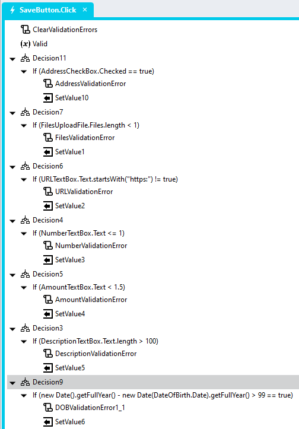

# Display Custom Validation Failure

The Stadium built-in validations only handle a small set of the most common validations. So, sometimes we need to add our own custom validations to the "Save" Button.Click event handler to ensure that the data provided by users conforms to the requirements. 

When we add such custom validations, we cannot display our error message under the field and usually use a *Notification* action to inform the user. We are also not able to style the failed field as per a failed built-in validation. 

When a custom validation fails, this module 
1. Will style failed fields as per built-in validations
2. Will display a custom validation message under the failed control
3. Can be configured to scroll to show the failed control

https://github.com/user-attachments/assets/b07966c8-e590-445e-999b-32d9004f6616

# Version
Initial 1.0

# Setup

## Application Setup
1. Check the *Enable Style Sheet* checkbox in the application properties

## Global Scripts
This module requires the creation of two Global Scripts. One to display validation messages and another to clear them. 

### Display Validation Error
1. Create a Global Script called "DisplayValidationError"
2. Add the input parameters below to the Global Script
   1. classname
   2. message
   3. scrolltoclass
3. Drag a *JavaScript* action into the script
4. Add the Javascript below into the JavaScript code property
```javascript
/* Stadium Script v1.0 https://github.com/stadium-software/display-validation-error */
let errMessage = ~.Parameters.Input.message;
let scrollToClassName = ~.Parameters.Input.scrolltoclass;
let className = ~.Parameters.Input.classname;
let el = document.querySelector("." + className);
if (el) {
    let err = el.querySelector(".validation-error");
    if (!err) { 
        err = document.createElement("div");
        err.classList.add("validation-error");
        el.appendChild(err);
    }
    err.setAttribute("style", "display:block;max-width: " + (el.getBoundingClientRect().width - 10) + "px;white-space: normal;");
    err.textContent = errMessage;
    el.classList.add("has-validation-error", "custom-validation");
    
    let scrollPoint = document.querySelector("." + scrollToClassName);
    if (scrollPoint) {
        scrollPoint.scrollIntoView({ behavior: "smooth" });
    }
}
```

### Clear Validation Errors
1. Create a Global Script called "ClearValidationErrors"
2. Add the input parameters below to the Global Script
3. Drag a *JavaScript* action into the script
4. Add the Javascript below into the JavaScript code property
```javascript
/* Stadium Script v1.0 https://github.com/stadium-software/display-validation-error */
let allVals = document.querySelectorAll(".has-validation-error.custom-validation");
for (let i = 0; i < allVals.length; i++) {
    let err = allVals[i].querySelector(".validation-error");
    err.style.display = "none";
    err.textContent = "";
    allVals[i].classList.remove("has-validation-error", "custom-validation");
}
```

## Page
1. Drag some form controls to a page (e.g. *TextBox*, *DatePicker*, *UploadFile*)
2. Add a class to the control classes property that uniquely identifies the control
3. Drag a *Button* control to the page & set the *Button* text property
4. Add a *Click* event handler for the *Button* control

## Button.Click Event Handler
1. Drag the "ClearValidationErrors" global script to the event handler (to clear all validations before they are re-run)
2. Drag a *Variable* to the Button.Click event handler
3. Set the *Variable* name to "Valid"
4. Set the *Variable* value to "true" (or "= true")
5. Drag a *Decision* to the event handler for each control you are evaluating
   1. Uncheck the "Show else" property checkbox on the *Decision*
   2. Define the conditions that will cause the validation to fail in the *Decisions* condition property (e.g. TextBox.Text.length > 100)
   3. Drag a "DisplayValidationError" into the *If* condition branch in the canvas
   4. Set the script input parameters 
      1. message: The error message you want to display
      2. classname: The unique classname you assigned to the form control
      3. scrolltoclass (optional): If you want the page to scroll to a specific field in the page, assign a unique class to the control and provide that class here (e.g. the form control or the form control label, for example)
   5. Drag a SetValue into the *If* condition branch in the canvas
      1. Target: The "Valid" *variable*
      2. Value: "false" (or "= false")



6. After you have defined all conditions in this way, add another *Decision* to the event handler
   1. Uncheck the "Show else" property checkbox on the *Decision*
   2. If the "Valid" *variable* is still "true", the form has been successfully validated and you can process the form data

